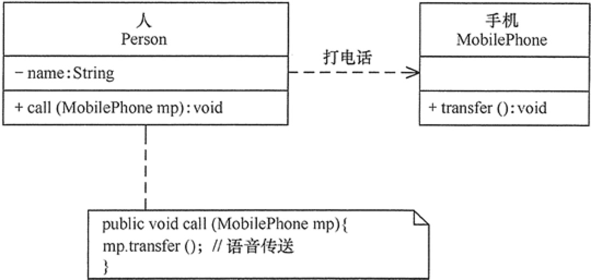
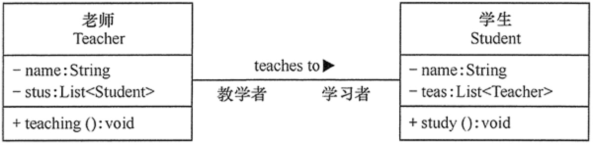
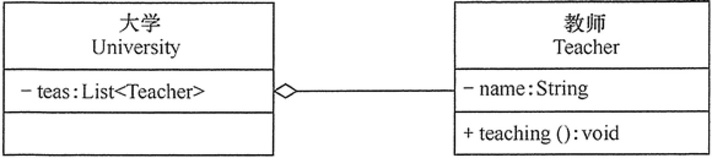
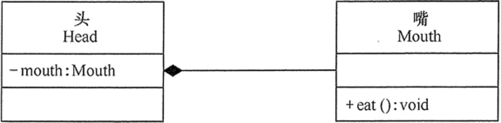
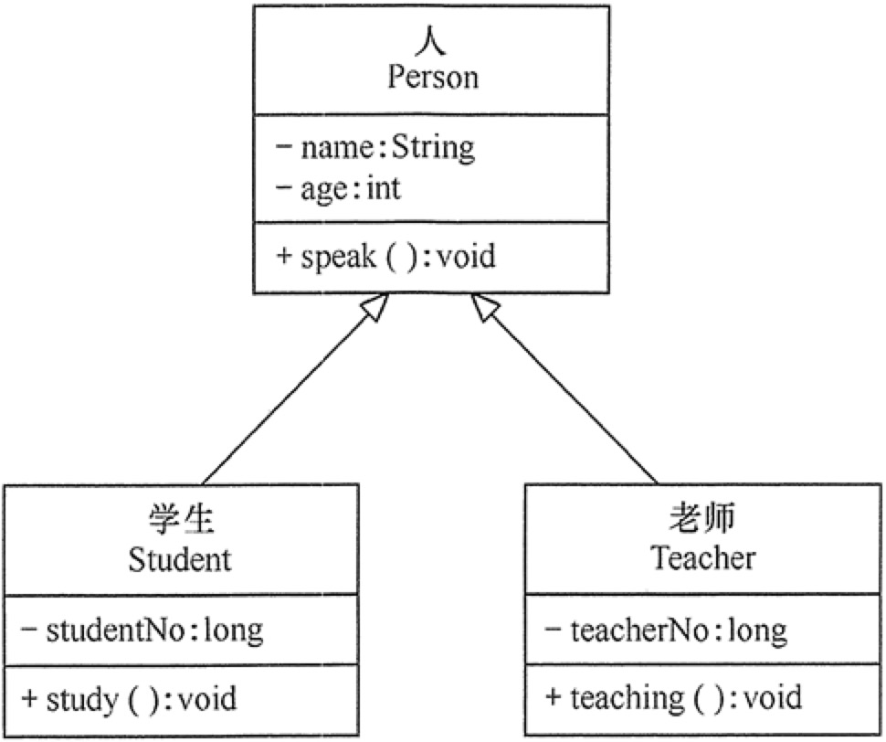
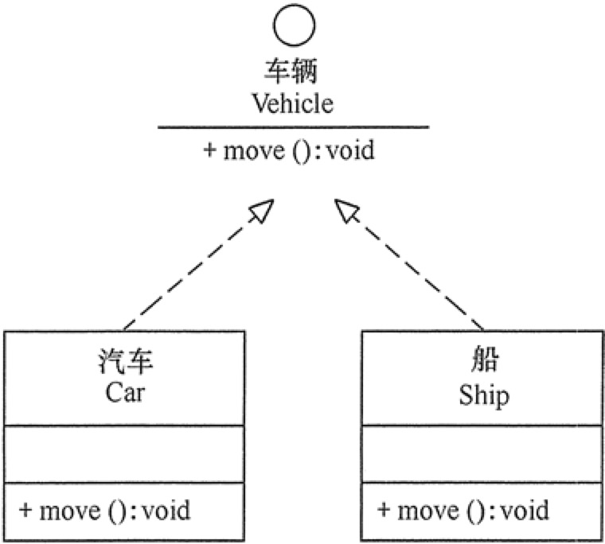

### 1. 可见性
可见性表示该属性对类外的元素是否可见，包括公有（Public）、私有（Private）、受保护（Protected）和朋友（Friendly）4 种，在类图中分别用符号+、-、#、~表示。
### 2. 类之间的关系
根据类与类之间的**耦合度从弱到强，关系依次是：依赖关系、关联关系、聚合关系、组合关系、泛化关系、实现关系。其中泛化和实现的耦合度相等**，他们是最强的。

1. 依赖关系（Dependency）：是一种使用关系。
在代码中，**某个类的方法通过局部变量、方法的参数或者对静态方法的调用来访问另一个类（被依赖类）中的某些方法来完成一些职责**。

方向：箭头从使用类指向被依赖的类

2. 关联关系（Association）：是一种引用关系，可以是单向的，也可以是双向的。（可以通过带两个箭头或者没有箭头的实线表示）

在代码中，将一个类的对象作为另一个类的成员变量

方向：箭头从使用类指向被关联的类

3. 聚合关系（Aggregation）：关联关系的一种，是强关联关系，是整体和部门的关系，是has-a的关系。

在代码中：通过成员变量来实线，其中成员对象是整体对象的一部分，但是成员对象可以脱离整体对象而独立存在。

方向：部分指向整体，箭头是空心的菱形

4. 组合关系（Composition）：也是关联关系的一种，也表示类之间的整体与部分的存在，但是是一种更强烈的聚合关系，是contains-a关系。

整体对象控制部门对象的生命周期，一旦整体对象不存在，部分对象也将不存在，部分对象不能脱离整体对象而存在。

方向：部分指向整体，箭头是实心菱形。

5. 泛化关系（Generalization）：对象之间耦合度最大的一种关系，表示一般与特殊的关系，是父子之间的关系，是一种继承关系，是is-a关系

在代码实现中：使用面向对象的继承机制来实现

方向：子类指向父类，空心三角箭头

6. 实现关系（Realization）：接口与实现类之间的关系，类实现了接口，类中的操作实现了接口中所声明的所有的抽象操作。

方向：实现类指向接口，空心三角箭头，虚线

#### 资源
[UML中的类图及类图之间的关系](http://c.biancheng.net/view/1319.html)

