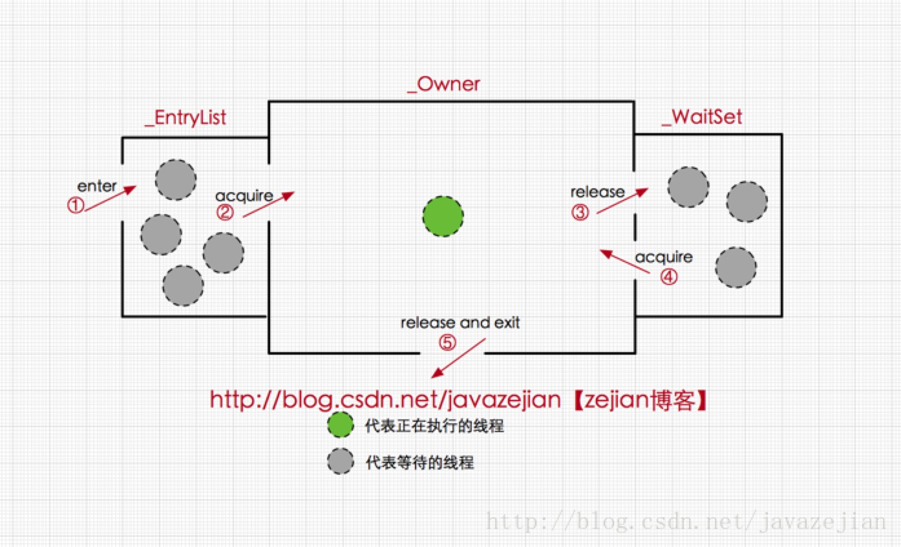

每一个锁都对应一个monitor对象，在HotSpot虚拟机中它是由ObjectMonitor实现的（C++实现）。

每个对象都存在着一个monitor与之关联，对象与其monitor之间的关系有存在多种实现方式，
如monitor可以与对象一起创建销毁或当线程试图获取对象锁时自动生成，但当一个monitor被某个线程持有后，它便处于锁定状态。
```
ObjectMonitor() {
    _header       = NULL;
    _count        = 0;  //锁计数器，自旋
    _waiters      = 0,
    _recursions   = 0;
    _object       = NULL;
    _owner        = NULL;
    _WaitSet      = NULL; //处于wait状态的线程，会被加入到_WaitSet
    _WaitSetLock  = 0 ;
    _Responsible  = NULL ;
    _succ         = NULL ;
    _cxq          = NULL ;
    FreeNext      = NULL ;
    _EntryList    = NULL ; //处于等待锁block状态的线程，会被加入到该列表
    _SpinFreq     = 0 ;
    _SpinClock    = 0 ;
    OwnerIsThread = 0 ;
}
```
  
ObjectMonitor中有两个队列_WaitSet和_EntryList，用来保存ObjectWaiter对象列表(每个**等待锁的线程都会被封装ObjectWaiter对象**)，

_owner指向持有ObjectMonitor对象的线程，
当多个线程同时访问一段同步代码时，首先会进入_EntryList 集合，
当线程获取到对象的monitor 后进入 _Owner 区域并把monitor中的owner变量设置为当前线程，同时monitor中的计数器count加1，
若线程调用 wait() 方法，将释放当前持有的monitor，owner变量恢复为null，count自减1，同时该线程进入 WaitSet集合中等待被唤醒。

若当前线程执行完毕也将释放monitor(锁)并复位变量的值，以便其他线程进入获取monitor(锁)。   

monitor对象存在于每个Java对象的对象头中(存储的指针的指向)，synchronized锁便是通过这种方式获取锁的，也是为什么Java中任意对象可以作为锁的原因，同时也是notify/notifyAll/wait等方法存在于顶级对象Object中的原因。



synchronize的字节码原理
```
monitorenter  //进入同步方法
//..........省略其他  
monitorexit   //退出同步方法
goto          24
//省略其他.......
monitorexit //退出同步方法
```
从字节码中可知同步语句块的实现使用的是monitorenter 和 monitorexit 指令，
其中monitorenter指令指向同步代码块的开始位置，monitorexit指令则指明同步代码块的结束位置，
当执行monitorenter指令时，当前线程将试图获取 objectref(即对象锁) 所对应的 monitor 的持有权，
当 objectref 的 monitor 的进入计数器为 0，那线程可以成功取得 monitor，并将计数器值设置为 1，取锁成功。
如果当前线程已经拥有 objectref 的 monitor 的持有权，那它可以重入这个 monitor (关于重入性稍后会分析)，重入时计数器的值也会加 1。
倘若其他线程已经拥有 objectref 的 monitor 的所有权，那当前线程将被阻塞，直到正在执行线程执行完毕，即monitorexit指令被执行，执行线程将释放 monitor(锁)并设置计数器值为0 ，其他线程将有机会持有 monitor 。

值得注意的是编译器将会确保无论方法通过何种方式完成，方法中调用过的每条 monitorenter 指令都有执行其对应 monitorexit 指令，而无论这个方法是正常结束还是异常结束。
为了保证在方法异常完成时 monitorenter 和 monitorexit 指令依然可以正确配对执行，编译器会自动产生一个异常处理器，这个异常处理器声明可处理所有的异常，它的目的就是用来执行 monitorexit 指令。
从字节码中也可以看出多了一个monitorexit指令，它就是异常结束时被执行的释放monitor 的指令。

[深入理解Java并发之synchronized实现原理](https://blog.csdn.net/javazejian/article/details/72828483)