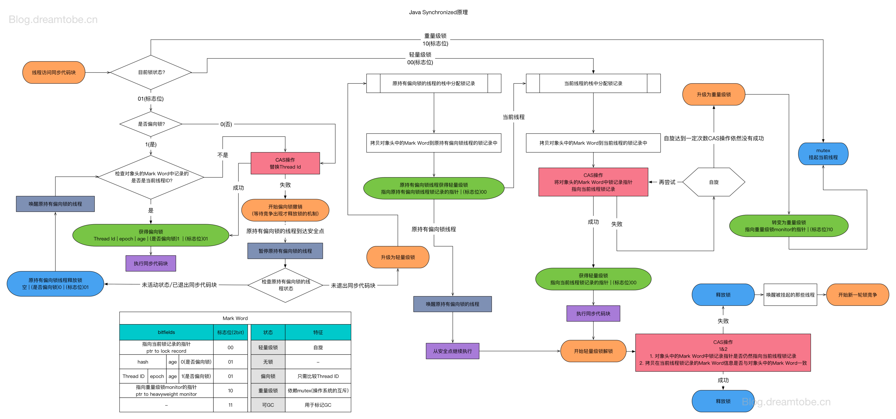
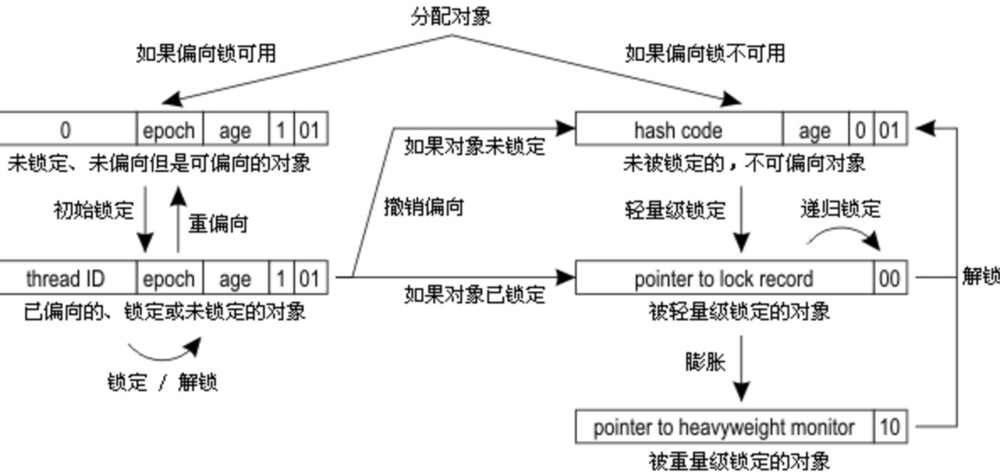

## 总结
偏向锁、轻量级锁、重量级锁适用于不同的并发场景：
+ 偏向锁：无实际竞争，且将来只有第一个申请锁的线程会使用锁。
+ 轻量级锁：无实际竞争，多个线程交替使用锁；允许短时间的锁竞争。
+ 重量级锁：有实际竞争，且锁竞争时间长。

#### 锁分配和膨胀的过程

#### 简化版本的锁状态变化

## 轻量级锁

+ 轻量级锁加锁：
    1. 代码进入同步块时，如果同步对象锁状态是无锁状态（01，需要管偏向吗？），则在当前线程的栈帧中建立锁记录（Lock Record）的空间，用于存储对象目前的Mark Word的拷贝，官方成为Displaced Mark Word
    2. 拷贝对象头的Mark Word到锁记录中
    3. 拷贝成功后，虚拟机通过CAS尝试将对象的Mark Word更新为Lock Record的指针，并将Lock Record的owner指针指向对象的Mark Word
    4. 若是更新成功，则这个线程拥有了该对象锁，并且设置对象的Mark Word的锁标志为“00”，此时对象处于轻量级锁定状态。
    5.如果更新操作失败，说明多个线程竞争锁，膨胀为重量级锁
     
+ 轻量级锁解锁：
    1. 通过CAS尝试将线程中复制的Displaced Mark Word替换成当前对象的Mark Ward
    2. 若果替换成功，完成
    3. 否则替换失败，说明其他线程尝试过获取该锁（此时锁已膨胀），那就要在释放锁的同时，唤醒被挂起的线程。
   
   
## 偏向锁

+ 偏向锁（锁标志位01，偏向1）加锁：
    - 若是对象处于可偏向状态：
         1. CAS尝试将自己的线程ID写入到MarkWord
         2. 若是操作成功，则认为已经获取到该对象的偏向锁，执行同步代码块
            + 注意：一个线程执行完同步代码块之后，并不会尝试将Mark Word中的线程id赋回原值。这样的好处是：该线程需要再次对该对象加锁，而这个对象之前一直没有被其他线程获取到锁，依旧停留在可偏向的状态下，即可在不修改对象头的情况下，直接认为偏向成功。
         3. 如果CAS失败，则说明有一个线程B抢先获取到了偏向锁。此时需要撤销B线程获取的偏向锁，将线程B持有的锁（不知道是对象）升级为轻量级锁，该操作需要等到安全点
    - 若是对象处于已偏向状态
         1、则检测MarkWord中存储的线程id是否等于当前线程id
         2、如果相等，则证明本线程已经获取到偏向锁，可以直接执行同步代码块
         3、如果不等，则证明该对象目前偏向于其他线程，则需要**撤销**偏向锁
+ 偏向锁的撤销（在偏向锁CAS更新失败，等待到达安全点）
    1. 通过MarkWard中存在的线程ID找到成功获取了偏向锁的那个线程，然后在该线程的栈帧中补充上轻量级锁时，会保存锁记录，然后将获取了偏向锁对象的MarkWord更新为指向这条锁记录的指针（说的不完全，不知道是就是这么少，还是没说完？？？）
        + 偏向锁不存在解锁操作，只有撤销操作。
        + 注意偏向锁的撤销不是将对象获取到无锁可偏向状态，直接将被偏向的对象“升级到”被加了轻量级锁的状态。

## 偏向锁-》轻量级锁

  1. 不可偏向的无锁状态（主要是因为多余一个线程竞争，就不允许偏向了）(原来已经获取了偏向锁的线程已经执行完同步代码块)
  2. 不可偏向的已锁状态（获取偏向锁的线程可能尚未执行完同步代码块，偏向锁依旧有效）
     
     
 ## 引用
 + [每个锁状态的特点讲的很清楚](https://www.cnblogs.com/paddix/p/5405678.html)
 + [针对偏向锁到轻量级锁切换讲的很清楚](https://blog.csdn.net/lengxiao1993/article/details/81568130)
 + [锁各个状态的流程转化](https://monkeysayhi.github.io/2018/01/02/%E6%B5%85%E8%B0%88%E5%81%8F%E5%90%91%E9%94%81%E3%80%81%E8%BD%BB%E9%87%8F%E7%BA%A7%E9%94%81%E3%80%81%E9%87%8D%E9%87%8F%E7%BA%A7%E9%94%81/)
     
     
     
     
     
     
     
     
     
     
     
     
     
     
     
     
     
     
     
     