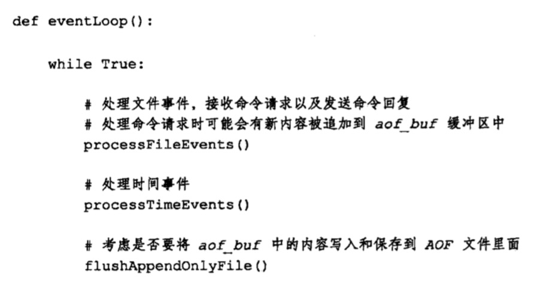
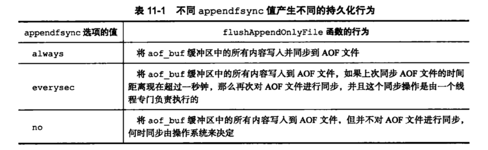
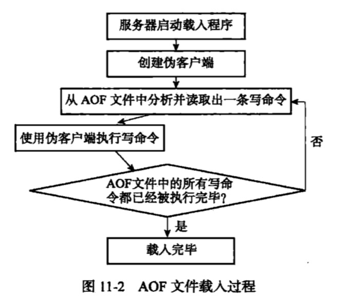

## AOF持久化
### 本章知识点
1. [AOF持久化的实现](#AOF持久化的实现)
2. [AOF文件的载入与数据还原](#AOF文件的载入与数据还原)
3. [AOF重写](#AOF重写)

### <span id="AOF持久化的实现">AOF持久化的实现</span>
AOF持久化功能的实现可以分为命令追加、文件写入、文件同步三个步骤：
1. 命令追加  
服务器在执行一个写命令之后，会议协议格式将被执行的写命令追加到服务器状态的aof_buf缓冲区的末尾。
```
struct redisServer {
    // ...
    
    // aof缓存区
    sds aof_buf；
}
```
追加的内容：
*(n个操作命令)\r\n + N($(字符长度)\r\n(字符串)\r\n)
例如：
```
set msg "hello"
*3\r\n$3\r\nset\r\n$3\r\nmsg\r\n$5\r\nhello\r\n
```
2. AOF文件的写入与同步  
redis的服务器进程就是一个事件循环，这个循环中文件事件负责接收客户端的命令请求，以及向客户端发送命令回复，而时间事件则负责执行像servercron函数这样需要定时运行的函数。

因为服务器在处理文件事件时可能会执行写命令，使得一些内容被追加到aof_buf缓冲区，所以在服务器每次结束一个事件循环之前，都会调用flushAppendOnlyFile函数，考虑是否需要将aof_buf缓冲区中的内容写入和保存到AOF文件里面。  

flushAppendOnlyFile函数的行为由appendfsyn选项的值来决定，不同值产生的行为：  

```
文件的写入与同步：

为了提高文件写入的效率，将一些数据写入到文件的时候，操作系统通常会将写入数据暂时保存在一个内存缓冲区里面，等到缓冲区的空间被填满、或者超过指定的时限后，才真正的将缓冲区的数据写入到磁盘中。  

这种做法虽然提高了效率，但是为写入数据带来了安全问题，如果计算机发生停机，那么保存在内存缓冲区里面的数据将会丢失。

为此，系统提供了fsync和fdatasync两个同步函数，他们强制让操作系统立即将缓冲区的数据写入到磁盘中，从而确保写入数据的安全性。

```

### <span id="AOF文件的载入与数据还原">AOF文件的载入与数据还原</span>
+ 因为AOF文件里面包含了重建数据库状态所需的所有的写命令，所以服务器只要读入并重新执行一遍AOF文件里面保存的写命令，就可以还原服务器关闭之前的数据库状态。
+ Redis读取AOF文件并还原数据库状态的详细步骤
    1. 创建一个不带网络连接的伪客户端：因为redis的命令只能在客户端上下文中执行，而载入AOF文件时所需的命令直接来源于AOF文件而不是网络连接，所以服务器使用了一个没有网络连接的伪客户端来执行AOF文件保存的写命令，伪客户端执行命令的效果和带网络连接的客户端执行命令的效果完全一样。
    2. 从AOF文件中分析并读入一条写命令
    3. 使用伪客户端执行被读出的写命令
    4. 重复执行2.3步骤，直到AOF文件中的所有写命令被完整的还原出来。   



### <span id="AOF重写">AOF重写</span>
+ 因为AOF持久化是通过保存被执行的写命令来记录数据库状态的，所以随着服务器运行时间的流逝，**AOF文件中的内容越来越多，体积也越来越大**。
+ 为了**解决AOF文件体积膨胀的问题，Redis提供AOF文件重写**。Redis服务器可以创建一个新的AOF文件来替换现有的AOF文件，新旧两个AOF文件所保存的数据库状态相同，
但是新的AOF文件不会包含任何浪费空间冗余命令，所以新的AOF文件的体积通常要比旧的AOF文件体积小很多。
+ 虽然新旧文件替换叫做AOF文件重写，其实AOF文件重写**并不需要对现在的AOF文件进行任何读取、分析或者写入操作**，这个功能是**通过读取服务器当前的数据库状态来实现的**。
+ 为了避免执行命令时造成客户端缓冲区溢出，重写处理列表等要求键所包含的元素的数量不超过64个。


+ AOF重写会被长时间阻塞，为了解决这个问题，通过**AOF后台重写**，子进程带有服务器进程的数据副本，使用子进程而不是线程，可以避免使用锁的情况下，保证数据的安全性。
+ AOF后台重写时，父进程还继续处理命令请求，所以这段时间导致的数据库状态不一致，所以Redis服务器设置了一个**AOF重写缓冲区**，这个缓冲区在服务器创建子进程之后开始使用，redis服务器执行完一个写命令，同时将这两个写命令发送给AOF缓冲区和AOF重写缓冲区。

+ 通过A**OF缓冲区的内容会定期被写入和同步到AOF文件**，对现在AOF文件的处理工作会如常进行
+ 从创建子进程开始，服务器执行的所有的写命令都会被记录到AOF重写缓冲区里面。
+ 当子进程完成AOF重写工作后，他会向父进程发送一个信号，父进程接收到信号之后，会将**AOF重写缓冲区的内容写入到新的AOF文件**，对新的AOF文件进行改名，原子的覆盖现有的AOF文件，完成新旧文件替换。（**这个过程是阻塞的**）


