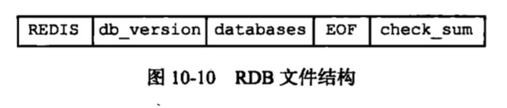

## RDB持久化
### 本章知识点
1. [RDB文件的创建与载入](#RDB文件的创建与载入)
2. [自动间隔性保存](#自动间隔性保存)
3. [RDB文件结构](#RDB文件结构)

### <span id="RDB文件的创建与载入">RDB文件的创建与载入</span>
有两个命令可以用于生成RDB文件：
+ SAVE：阻塞Redis服务器进程，直到RDB文件创建完毕为止，在服务器进程阻塞期间，服务器不能处理任何命令请求
+ BGSAVE：派生出一个子进程，然后由子进程负责创建RDB文件，服务器进程（父进程）继续处理命令请求。
    + 在BGSAVE执行期间，客户端发送的SAVE会被服务器拒绝，服务器禁止SAVE命令和BGSAVE命令会通知执行，为了避免父进程和子进程同时执行两个rdbsave调用，防止产生静态条件。
    + 在BGSAVE执行期间，客户端发送的BGSAVE会被服务器拒绝
    + 在BGSAVE执行期间，客户端发送的BGREWRITEAOF命令会被延迟到BGSAVE命令执行完毕之后执行。
    + 在BGREWRITEAO执行期间，客户端发送的BGSAVE命令会被服务器拒绝。（这两个命令不能同时执行只是一个性能考虑，防止两个子进程都同时执行大量的磁盘写入操作。）

RDB文件的载入工作是在服务器启动时自动执行的，所以Redis并可以专门用于载入RDB文件的命令，只要Redis服务器在启动时检测到RDB文件存在，它就会自动载入RDB文件。

另外，因为AOF文件的更新频率通常比RDB文件的更新频率高，所以：
+ 如果服务器开启了AOF持久化功能，那么服务器会优先使用AOF文件来还原数据库状态
+ 只有在AOF持久化功能处于关闭状态，服务器才会使用RDB文件来还原数据库状态


### <span id="自动间隔性保存">自动间隔性保存</span>
+ 用户可以通过save命令选项设置多个保存条件，只要其中一个被满足，服务器就会被执行BGSAVE命令如
    + save 900 1        900秒之内，对数据库进行了至少1次的修改
    + save 300 10       300秒之内，对数据库进行了至少10次的修改
    + save 60  10000    60秒之内，对数据库进行了至少10000次的修改
+ <span id = "saveparams">服务器程序会根据sava选项所设置的保存条件，设置服务器redisServer的saveparams属性</span>
```
struct redisServer {
    // ...
    
    // 记录了保存条件的数组
    struct saveparams *saveparams；
}
```
```
struct saveparams {
    // 秒数
    time_t secends；
    // 修改数
    int changes；
}
```
+ dirty计数器和lastsave属性
    + dirty计数器距离上次成功执行save/bgsave命令之后，服务器对所有数据库进行了多少次的修改
    + lastsave属性时一个unix时间戳，记录了服务器上一次成功执行save、bgsave命令的时间

+ 检查保存条件是否满足
redis服务器周期性操作函数serverCron默认每隔100毫秒就会执行一次，该函数用于对正在运行的服务器进行维护，他的其中一项工作就是检查save选项所设置的保存条件是否已经满足，如果满足，就执行bgsave命令。


### <span id="RDB文件结构">RDB文件结构</span>
+ 文件结构示意图：注意大写是常量，RDB是二进制数据，所以为了简便起见，和C不同，没有'\0'结尾，RDB所有的文件结构图都遵循这一规则。

    + REDIS：类似字节码的魔数
    + db_version：4个字节
    + datebases：部分包含着零个或者任意多个数据库，以及各个数据库中的键值对数据：
        + 如果服务器的数据库状态为空（所有数据库都是空的），那么这部分也为空，长度为0字节
        + 如果服务器的数据库状态不为空（至少一个数据库非空），name这个部分也为非空，根据数据库所保持的键值对的数量、类型和内容不同，这部分长度也有所不。
    + EOF：1字节，标志RDB文件正文内容结束。
    + check_sum：8字节的无符号整数，保存校验和，通过前4部分的内容计算得出，防止文件出错或者损坏。

+ datebases部分
文件结构示意图：

    + SELECTDB：常量，1字节，当程序遇到这个值，知道接下来要读取的是一个数据库号码。
    + db_number：保存着一个数据库号码，根据号码的大小不同，这部分可以是1字节、2字节、5字节。读入这个参数，服务器会调用select命令，根据读入的数据库号码进行数据库切换，使读入的键值对可以载入到正确的数据库。
    + key_value_pairs：保存数据库所有的键值对数据。如果键值对带有过期时间，那么过期时间也会和键值对保存在一起。

+ key_value_pairs部分
文件结构示意图：红框内是不带过期时间的，整体是带过期时间

+ 此部分保存了一个或以上数量的键值对，如果键值对带有过期时间，那么过期时间也会和键值对保存在一起。
+ 不带过期时间的键值对在RDB文件中由TYPE、KEY、VALUE三部分组成。
    + TYPE：常量，一个字节，由类型+编码共同组成的新的类型，如REDIS_RDB_TYPE_LIST、REDIS_RDB_TYPE_LIST_ZIPLIST
    + KEY：字符串对象，编码方式跟REDIS_RDB_TYPE_STRING类型的value一样
+ 带过期时间的键值对在RDB中增加了EXPIRETIME_MS和ms
    + EXPIRETIME_MS：常量，一个字节，告知接下来读取的是一个毫秒的过期时间
    + ms：8字节长的带符号整数，记录一个以毫秒为单位的unix时间戳
    
+ value的编码
1. String：type + length + value;
2. int: type + value;
3. list: type + length + item1 + item2 +.. + itemN;
4. set: type + length + item1 + item2 +.. + itemN;
5. map: type + length + key1 + value1 + key2 + value2 +.. + keyN + valueN;
6. zset: type + length + key1 + score1 + key2 + score2 +.. + keyN + scoreN;
7. intset/ziplist: type + length + String(value)


