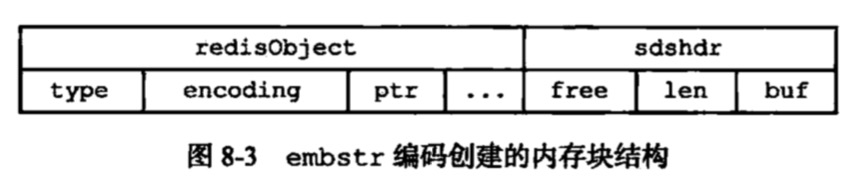
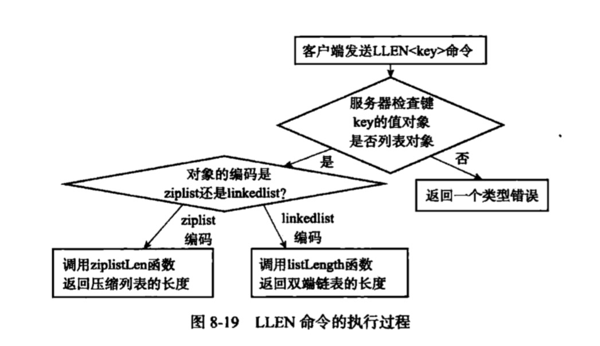

## redis对象
+ redis一共有5种对象，包括：  
    [1. 字符串对象：REDIS_STRING](#string)  
    [2. 列表对象：REDIS_LIST](#list)
    [3. 哈希对象：REDIS_HASH](#hash)  
    [4. 集合对象：REDIS_SET](#set)  
    [5. 有序集合对象：REDIS_ZSET](#zset)  
    
 每种对象都用到至少一种的数据结构，对象的结构为(通过type+encoding极大地提高了redis的灵活性和效率)：
 ```
 // redisObject应该只有这五种属性
 typedef struct redisObject {
    // 类型，指的是5种对象，查看此类型：TYPE key
    unsigned type:4;
    // 编码，就是所有的数据结构实现的，通过redis命令：object encoding key
    unsigned encoding:4;
    // 指向底层实现数据结构的指针
    void *ptr;
    
    // 引用计数
    int refcount;
    
    // 对象最后一次被命令程序访问的时间，通过object idletime key计算出指定键的空转时长
    unsigned lru:22;
 } robj;
```
每个对象（也就是类型）都对应不同的编码：
```
            /   REDIS_ENCODING_INT(int)：使用整数值实现的字符串对象
REDIS_STRING -  REDIS_ENCODING_EMBSTR(embstr)：使用embstr编码的简单动态字符串
            \   REDIS_ENCODING_RAW(raw)：使用简单动态字符串实现的字符串对象

            /   REDIS_ENCODING_ZIPLIST(ziplist)
REDIS_LIST  -
            \   REDIS_ENCODING_LINKEDLIST(linkedlist)

            /   REDIS_ENCODING_ZIPLIST(ziplist)
REDIS_HASH  -
            \   REDIS_ENCODING_HT(hashtable)
            
            /   REDIS_ENCODING_INTSET(intset)
REDIS_SET  -
            \   REDIS_ENCODING_HT(hashtable)
            
            /   REDIS_ENCODING_ZIPLIST(ziplist)
REDIS_ZSET  -
            \   REDIS_ENCODING_SKIPLIST(skiplist)
```

### <span id="string">字符串对象</span>
+ int：整数且可以用long类型表示的，会将字符串保存在对象中的ptr属性里面（将void*设置为long），encoding设置为int，**所以这个和字符串数据结构没有关系**
+ embstr：字符串的长度小于32字节
+ raw：保存的是字符串值，且字符串长度大于32字节

embstr是短字符串的一种优化编码方式，这两个方式都是通过sdshdr结构来表示字符串对象，但raw编码会调用2次内存分配函数来分别创建redisObject结构和sdshdr结构，但是embstr编码则通过一次内存分配来分配一块连续的空间，空间中一次包含了两个结构。


embstr编码的字符串的好处：  
1. embstr编码将创建字符串所需的内存分配次数从两次降为一次；
2. 释放embstr编码的字符串对象只需要调用一次内存释放，而raw需要2次
3. embstr编码的字符串都在一块连续的内存，所以更好的利用缓存带来的优势

浮点数也是按照字符串对象存储的，在需要的时候，程序会将字符串对象里面的字符串值转化为浮点数，执行某些操作，然后再执行操作所得浮点数值转回字符串值，继续保存在字符串对象里面。

**编码转换**：int编码的字符串和embstr编码的字符串对象在条件满足的情况加，会被转化为raw编码的字符串对象。
    
### <span id="list">列表对象</span>
+ ziplist：需要满足以下两个条件（这个条件也可以通过修改配置list-max-ziplist-value和list-max-ziplist-entries）
    + 列表对象保存的所有字符串元素的长度都小于64字节
    + 列表元素保存的元素数量小于512
+ linkedlist：不满足ziplist的条件则编码会转化为linkedlist

### <span id="hash">哈希对象</span>
+ ziplist：key和value分别推入压缩链表的表尾，存储条件（这个条件也可以通过修改配置hash-max-ziplist-value和hash-max-ziplist-entries）
    + 哈希对象保存的所有键值对的键和值的字符串长度都小于64字节
    + 哈希对象保存的键值对数量小于512（注意是键值对数量）
+ hashtable：

### <span id="set">集合对象</span>
+ intset：存储条件（这个条件也可以通过修改配置set-max-intset-value和set-max-intset-entries）
    + 集合对象保存的所有元素都是整数值
    + 集合对象保存的元素数量小于512
+ hashtable：

### <span id="zset">有序集合对象</span>
+ ziplist：存储条件（这个条件也可以通过修改配置zset-max-ziplist-value和zset-max-ziplist-entries）
    + 有序集合对象保存的所有键值对的键和值的字符串长度都小于64字节
    + 有序集合对象保存的键值对数量小于512（注意是键值对数量）
+ skiplist：
```
typedef struct zset {
    skiplist *zsl;
    dict *dict;
}
```
将skiplist和hashtable结合起来使用，skiplist使用成员、分值依次存储，hashtable存储成员、分值、这样可以通过O(1)的复杂度获取给定成员的分值。

### 类型检查与命令多态
redis会根据值对象的类型来判断键是否能够执行指定命令，还会根据值对象的编码方式，选择正确的命令实现代码来执行命令。

+ 类型检查
    1. 在执行一个类型特定命令之前，服务器会先检查输入数据库键的值对象是否为执行命令所需的类型，如果是，服务器就对键执行指定的命令；
    2. 否则，服务器拒绝执行命令，向客户端返回一个类型错误。

+ 多态命令的实现

  

### 内存回收
使用引用计数算法来实现内存回收机制，通过跟踪对象的引用计数信息，在适当的时候自动释放对象并进行内存回收。

### 对象共享
+ redis在初始化服务器时，创建0~9999这1w个字符串对象，服务器会使用这些共享对象，而不是新创建对象。
+ redis只对包含整数值的字符串对象进行共享，因为字符串值的字符串对象进行验证操作的复杂度是O(N)，列表对象的验证的操作复杂度是O(n^2)

### 对象的空转时长
object idletime 求得空转时长，通过当前系统时间-lru时间


