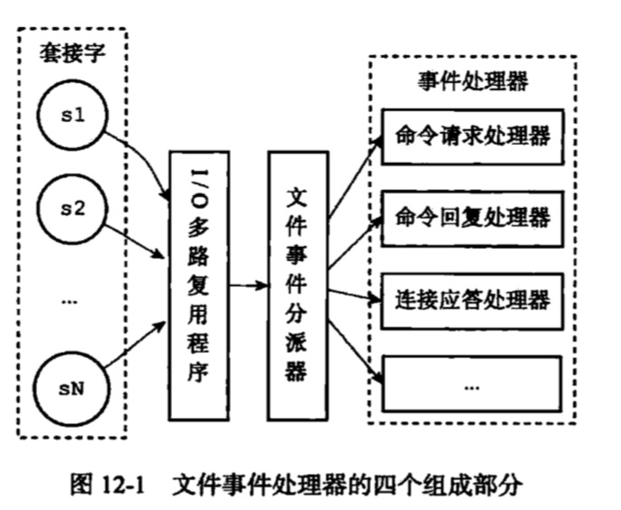
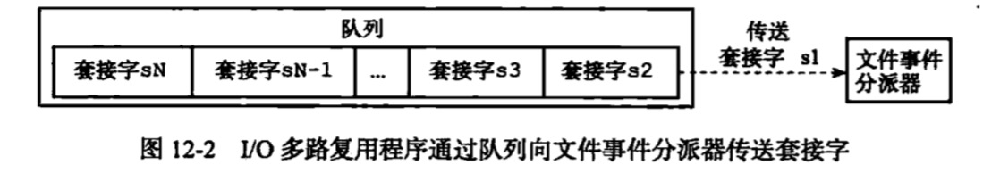
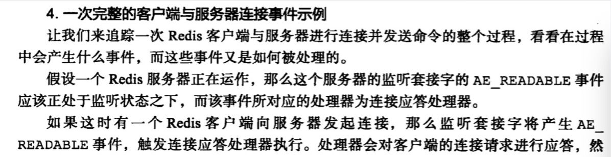
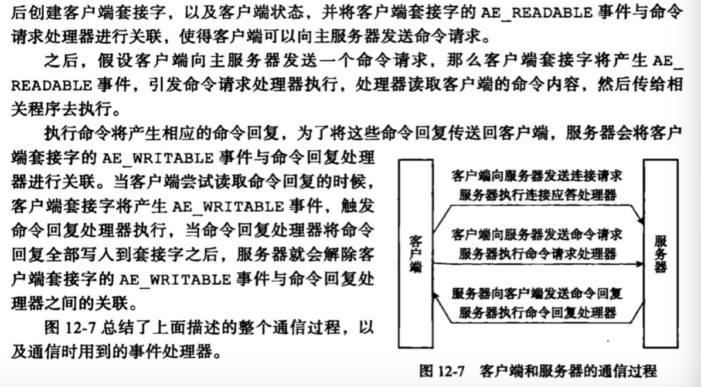
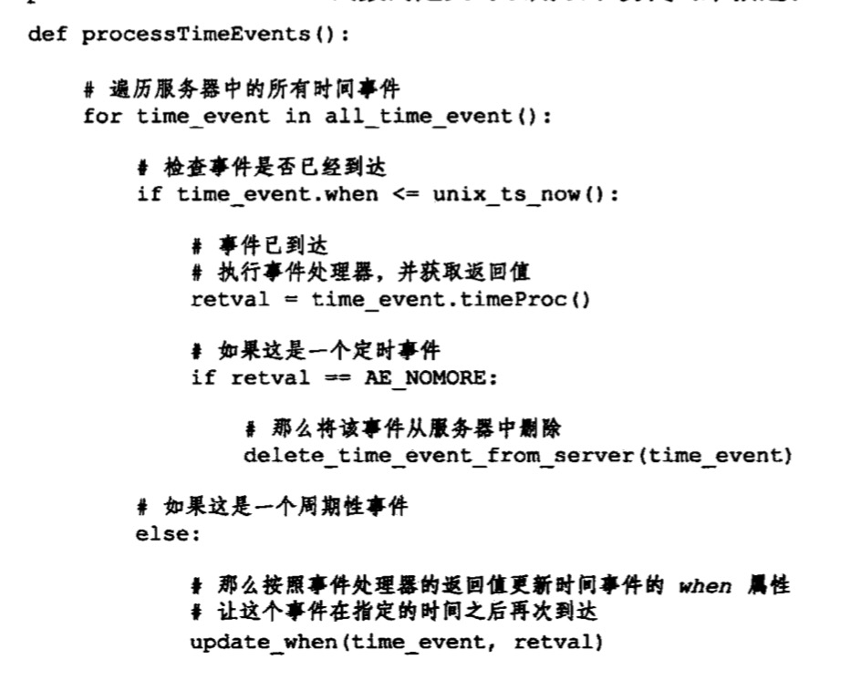
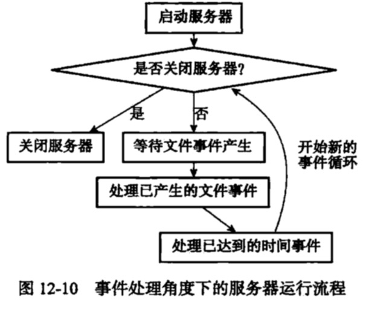
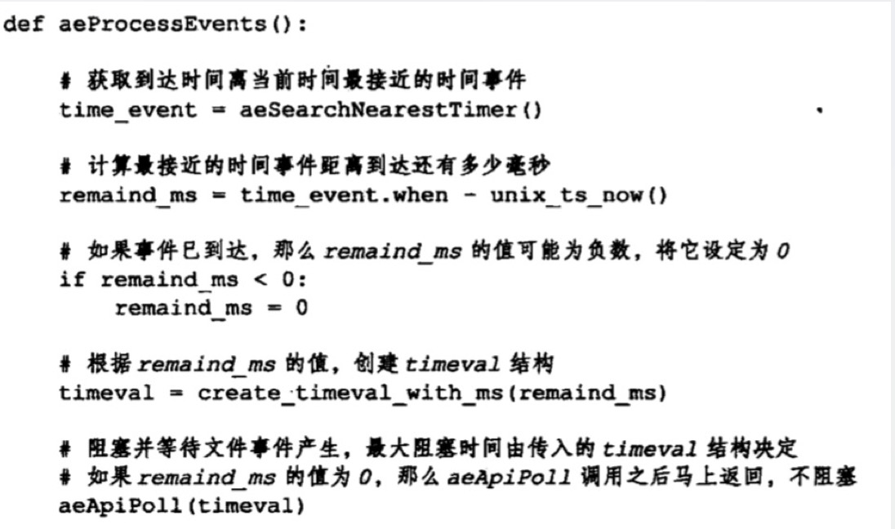
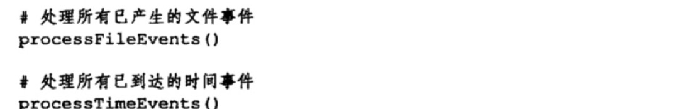

## 事件
### 本章知识点
1. [文件事件](#文件事件)
2. [时间事件](#时间事件)
3. [事件的调度与执行](#事件的调度与执行)

Redis服务器是一个事件驱动函数，服务器需要处理两类事件：
+ 文件事件：Redis服务器通过套接字与客户端（或者其他Redis服务器）进行连接，而文件事件就是服务器对套接字操作的抽象。
+ 时间事件：Redis服务器中的一些操作（如serverCron）需要在给定的时间点执行，而时间事件就是服务器对这类定时操作的抽象。

### 文件事件
1. Redis基于Reactor模式开发自己的网络事件处理器：这个处理器被称为文件事件处理器。
+ 文件事件处理器使用I/O多路复用程序来同时监听多个套接字，并根据套接字目前执行的任务来为套接字关联不同的事件处理器。
+ 当被监听的套接字准备好执行链接应答(accept)、读取（read）、写入（write）、关闭（close）等操作时，与操作相对应的文件时间会产生，这时文件事件处理器就会调用套接字之前关联好的时间处理器来处理这些事件。
虽然文件事件处理器以单线程方式运行，但通过使用I/O多路复用程序来监听多个套接字，文件事件处理器既实现了高性能的网络通信模型，又可以很好的与Redis服务器中其他同样以单线程方式运行的模块进行对接，这保持了Redis内部单线程设计的简单性。

2. 文件事件处理器的构成

+ 文件事件是对套接字操作的抽象，当一个套接字准备好执行链接应答(accept)、读取（read）、写入（write）、关闭（close）等操作时，就会产生一个文件事件。一个服务器通常会连接多个套接字，所以多个文件事件有可能并发的出现。
+ I/O多路复用程序负责监听多个套接字，并向文件事件派发器传送那些产生了事件的套接字
+ 监管文件事件可以并发的出现，但是I/O多路复用程序总会将所有产生事件的套接字都放到一个队列里，然后通过这个队列，以有序，同步、每次一个套接字的方式向文件事件分派器传送套接字。

+ 文件事件分派器接受I/O多路复用程序传来的套接字，并根据套接字产生的事件类型，调用相应的时间处理器。

3. I/O多路复用程序的实现
redis包装了select、epoll、evport、kqueue，程序会在编译时**自动选择系统中性能最高的I/O多路复用函数**。

4. 事件类型
+ AE_READABLE：当套接字变得可读（客户端对套接字执行write操作，或者close操作），或者有新的可应答（acceptable）套接字出现时（客户端对服务器的监听套接字执行connect操作）
+ AE_WRITEABLE：当套接字变得可写（客户端对套接字执行read）
I/O多了复用程序可以同时监听这两个事件，当一个套接字同时产生了这两个事件，那么文件时间分派器会优先处理AE_READABLE，然后处理AE_WRITEABLE。

5. 文件事件处理器
+ 连接应答处理器：为了对连接服务器的各个客户端进行应答。当redis服务器进行初始化时，程序会将这个连接应答处理器和服务器坚挺的套接字的AE_READABLE关联起来。当客户端用connect函数连接服务器端监听套接字时，套接字会产生AE_READABLE事件，引发连接应答处理器执行相应的套接字应答。
+ 命令请求处理器：为了接收客户端传来的命令请求。当客户端通过连接应答处理器成功连接到服务器后，服务器将客户端的套接字的AE_READABLE时间和命令请求处理器关联起来，当客户端向服务器发送命令请求的时候，套接字会产生AE_READABLE事件，引发命令请求处理器执行，并执行相应的套接字读入操作。当客户端连接服务器的整个过程中，服务器会一直为客户端套接字的AE_READABLE事件关联命令请求处理器。
+ 命令回复处理器：为了向客户端返回命令的执行结果。当服务器有命令回复需要传送给客户端，服务器会将客户端套接字的AE_WRITEABLE事件和命令回复处理器关联起来。当客户端准备好接受服务器传回的命令回复时，就会生成AE_WRITEABLE事件，引发命令回复处理器执行，并执行相应的套接字写入操作。当命令发送完毕之后，服务器就会解除命令回复处理器与客户端套接字的AE_WRITEABLE事件之间的关联。
+ 复制处理器：当主服务器和从服务器进行复制操作时，主从服务器都需要关联特别为复制功能编写的复制处理器

### 时间事件
Redis时间事件分为两类
+ 定时事件：让一段程序在指定时间之后执行一次（如让程序X在当前时间的30秒之后执行一次）
+ 周期性事件：让一段程序每隔指定时间就执行一次（如让程序Y每隔30秒就执行一次）

时间事件主要的属性：
+ id：服务器为时间事件创建的全局唯一ID，ID号从小到大顺序递增，新事件ID比旧事件ID大
+ when：毫秒精度的unix时间戳，记录了时间时间的到达时间
+ timeProc：时间事件处理器，一个函数。当时间事件到达时，服务器就会调用相应的处理器来处理事件。

一个时间事件是定时事件还是周期性事件，主要看事件处理器的返回值是否是AE_NOMORE，若是是定时事件，否则是周期性事件，根据返回值对时间时间的when进行更新，让这个事件在一段时间后继续执行。

redis只使用了周期性事件，没有使用定时事件。

#### 实现
**服务器将所有的时间事件都放在一个**无序链表（不是id无效，是when无序）**中，每当时间事件执行器运行时，他就**遍历整个链表，查找所有已到达的时间事件，并执行相应的事件处理器。

正常模式下，redis服务器就只使用serverCron一个时间事件。服务器几乎是将无序链表退化为指针来使用。

#### servercron函数的主要工作
1. 更新服务器的各类统计信息，比如时间，内存占用、数据库占用情况等。
2. 清理数据库中的过期键值对
3. 关闭和清理链接失效的客户端
4. 尝试进行AOF和RDB持久化操作
5. 如果服务器是主服务器，那么对从服务器进行定期同步
6. 如果集群模式，对集群进行定期同步和连接测试。

### 事件的调度与执行
因为服务器同时存在文件事件和时间事件两种事件类型，所以服务器必须对这两种事件进行调度。

这个地方不太理解的是aeApiPoll会阻塞至少timeval毫秒，但是processFileEvcents是可以执行的，只是processTimeEvents不可以执行的。
1. aeApiPoll函数的最大阻塞时间由到达时间最接近当前时间的时间事件决定，这个方法既可以避免服务器对时间事件进行频繁的轮询，又可以确保不会阻塞过长的时间。
2. 因为文件事件是随机出现的，如果等待并处理完一次文件事件后，仍未有任何时间事件到达，那么服务器将再次等待并处理文件事件。随着文件事件的不断执行，时间会逐渐向时间事件所设置的到达时间逼近，并最终来到到达时间，这时服务器就可以开始处理到达的时间事件了。
3. 对文件事件和时间事件的处理都是同步、有序、原子的执行，服务器不会中途中断事件处理，也不会对时间进行抢占。所以他们会尽可能减少程序的阻塞时间，并在有需要时主动让出执行权。
4. 时间事件的实际处理时间，通常回避时间事件设定的到达时间稍微晚点。

