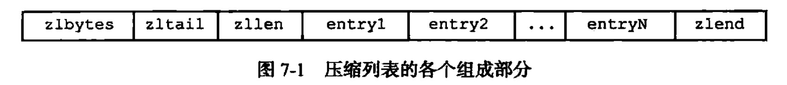
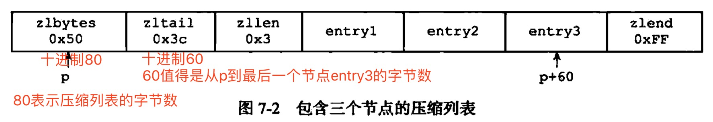
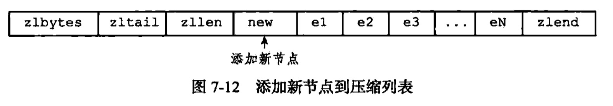
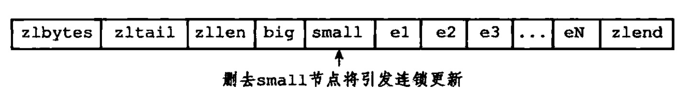

## 压缩链表
+ 是列表键、哈希键、有序集合键（应该也有集合键吧？）的底层实现之一
+ 当一个列表键只包含少量列表项，并且每个列表项要么就是小整数值，要么就是长度比较短的字符串，那么就会采用压缩链表实现
+ 压缩链表是Redis为了节约内存开发的，是由一些列特殊编码的连续内存块组成的顺序型数据结构。
+ 一个压缩列表可以包含任意多个节点（entry），每个节点可以保存一个字节数组或者是一个整数值（不固定类型）

### 定义：


压缩链表（注意zlbytes、zltail记录的是字节数）
**_下面的是自己定义的，仅供参考**_  

```
typedef struct ziplist {
    // zlbytes: 记录整个压缩列表所占的内存字节数：在对压缩列表进行内存重分配，或者计算zlend的位置时使用
    // zltail: 记录压缩列表尾节点距离压缩列表起始地址有多少个字节，通过这个偏移量，程序无需遍历整个压缩列表就可以确定表尾节点的地址
    uint32_t zlbytes, zltail;

    // zllen: 记录压缩列表所包含的节点数量，当这个属性值小于UINT16_MAX(65535)，记录的是真实值，否则需要遍历才能计算出
    uint16_t zllen;
    
    // 压缩列表包含的各个节点，长度由节点保存的内容决定
    struct zlentry[] enrty;
    
    // 特殊值，用于标记压缩列表的末端
    uint8_t zlend;
}ziplist;
```

压缩链表的节点(可以包含一个字节数组或者一个整数值)

+ previous_entry_length：记录压缩列表前一个节点的长度，可以是1字节（小于254）或者5字节（大于等于254（FE），前面两位不做计算），可以通过此字段计算出前一个节点的起始地址。
+ encoding：记录了节点content属性所保存数据的类型以及长度
    `
    字节数组：
        一个字节，最高位00
        两个字节，最高位01
        五个字节，最高位10
    整数：
        一个字节，最高位11
    `
+ content：保存的内容

### 连锁更新
+ 如果前一个节点的长度小于254字节，那么previous_entry_length的长度是一个节点，否则是5字节
如下图所示，增加一个新的节点new，大于254，e1~eN都是在250~253之间的，所以新插入一个元素，导致e1的previous_entry_length增加，继而导致后面所有的节点增加。

这个删除small，也会导致后面的都连锁更新。



