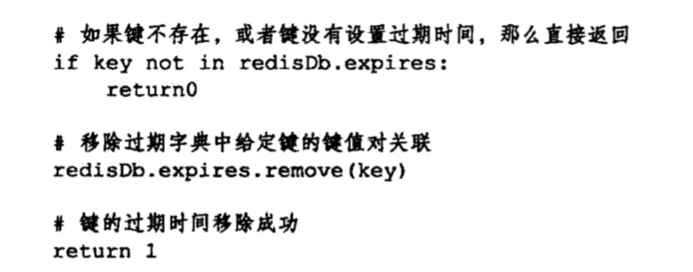

## 数据库
### 本章知识点
1. [服务端 + 客户端](#服务器+客户端)
2. [数据库键空间 + 读写键空间时的维护操作](#数据库键空间)
3. [过期间的判断 + 删除策略](#过期键)
4. [redis的过期键删除策略：惰性删除 + 定期删除](#redis的过期键删除策略)
5. [AOF、RDB和复制功能 对过期键的处理](#AOF、RDB和复制功能对过期键的处理)

### <span id="服务器+客户端">服务器+客户端</span>
redis服务器将所有的数据库都保存在redisService结构的数组中。([saveparams属性详情](RDB持久化.md#saveparams))
 ```
 typedef struct redisServer {
    // 用于保存服务器中所有的数据库，每个redisDb结构代表一个数据库
    redisDb *db;
    
    // 服务器的数据库数量，默认是16，切换数据库通过select命令
    int dbnum;
    
     // 记录了保存条件的数组
     struct saveparams *saveparams；
     
     // 修改计数器，距离上次成功执行save/bgsave命令之后，服务器对所有数据库进行了多少次的修改
     long long dirty;
     // 上次执行保存的时间，是个unix时间戳
     time_t lastsave;
     
     // AOF缓存区
     sds aof_buf;
     
     // AOF重写缓存区(自定义的名字，是在aof文件后台重写配套使用的)
     sds aof_rewrite_buf;
     
     // 一个链表，保存了所有客户端状态
     list *clients;
 } ;
```

在服务器内部，客户端状态redisClient结构的db属性记录了客户端当前的目标数据库：
```
typedef struct redisClient {
    // 用于记录客户端当前正在使用的数据库
    redisDb *db;
    
    // 客户端套接字描述符
    int fd;
    
    // 客户端名字
    robj *name;
    
    // 客户端角色
    int flags;
    
    // 输入缓冲区
    sds querybuf;
    
    // 命令参数，例如argv[0]=set,argv[1]=key,argv[2]=value
    robj **argv;
    
    // 命令参数的个数，上边的命令个数是3
    int argc;
    
    // 命令实现函数
    struct redisCommand *cmd;
    
    // 默认大小的输出缓冲区，大小默认是16 * 1024，及16KB
    char buf[REDIS_REPLY_CHUNK_BYTES];
    // 记录了buf数组已使用的字节数量
    int bufpos;
    
    // 超过默认缓冲区大小，分配的空间不限于16kb的影响
    list *reply;
    
    // 身份验证，为0表示客户端未通过身份验证，为1表示已经通过了身份验证
    int authenticated;
    
    // 创建客户端的时间，用于计算客户端与服务器已经连接了多少秒，在client list命令的age域记录
    time_t ctime;
    // 客户端与服务器最后一次进行交互的时间。用于计算客户端空转时间，上个命令的idle域记录。
    time_t lastinteraction;
    // 输出缓冲区第一次到达软性限制的时间。
    time_t obuf_soft_limit_reached_time;
 } redisClient;
```
### <span id="数据库键空间">数据库键空间 + 读写键空间时的维护操作</span>
数据库键空间：redis是一个键值对数据库服务器，服务器中的每个数据库都由一个redisDb结构表示的；  
redisDb结构的dict字典保存了数据库中的所有的键值对，我们将这个字典成为键空间；  
添加，删除，查找，修改一个键值对其实就是对dict的增删查改。  
用于清空整个数据库的FLUSHDB命令，就是通过删除键空间中所有键值对来实现的。  
```
typedef struct redisDb {
    // 数据库键空间，保存着数据库中的所有键值对
    dict *dict
    
    // 过期字典，保存着键的过期时间，字典的值是一个long long类型的整数，是一个毫秒精度的unix时间戳
    dict *expires;
 } redisDb;
```
redis命令对数据库进行读写时，服务器不仅会对键空间执行指定的读写操作，还会执行一些额外的维护操作，包括：  
 + 在读取一个键之后（读操作和写操作都要对键进行读取），服务器会根据键是否存在来更新服务器的键空间命中(hit)次数活键空间不命中(miss)次数，这两个值可以在info stats命令的keyspace_hits属性和keyspace_misses属性中查看
 + 在读取一个键之后，服务器会更新键的LRU(最后一次使用)时间，这个值可以用于计算键的空闲时间，使用object idletime key命令来查看键key的空闲时间。
 + 早服务器读取一个键发现该键已经过期，那么服务器会先删除这个过期键，然后才执行余下的其他操作
 + 如果客户端使用了watch命令监视某个键，那么服务器会对监视的键进行修改之后，会将这个键标记为脏（dirty），从而让事务程序注意到这个键已经被修改过。
 + 服务器每次修改一个键之后，都会对脏（dirty）键计数器的值增加1，这个计数器会触发服务器的持久化一肌肤之操作。
 + 如果服务器开启了数据库通知功能，那么对键进行修改之后，服务器将按配置发送相应的数据库通知。

### 设置键的生存时间或者过期时间
通过下面任意一个命令，客户端可以设置某个键的生存时间（Time To Live，ttl），在经过指定的秒数或者毫秒数之后，服务器会自动删除省委时间为0的键
```
expire key n秒
pexpire key n毫秒
```
也可以通过下面任意一个命令，给某个键设置过期时间(expire time)
```
expireat key unix时间戳-秒
pexpireat key unix时间戳-毫秒
```

以下是pexoireat命令的伪代码定义


ttl和pttl命令接收一个带有生命时间或是过期时间的键，返回这个键的剩余生存时间，也就是，返回距离这个键被服务器自动删除还有多长时间。  
注意这里的过期时间的dict和数据库dict共用指向同一个键对象，所以不会出现任何重复利用对象，也不会浪费任何空间。  
通过命令persist命令是pexpireat命令的反操作：persist命令在过期字典中查找给定的键，并解除键和值（过期时间）在过期字典中的关联。  
以下是persist命令的伪代码定义


注意ttl/pttl有3种值
```
        /   -2  键不存在数据库
ttl =   -   -1  键没有设置过期时间
        \   n   建的生存时间
```

### <span id = "过期键的删除">过期键的判定</span>
1. 检查给定键是否存在于过期字典，如果存在，那么取得键的过期时间。
2. 检查当前unix时间戳是否大于键的过期时间：如果是的话，那么键已经过期；否则的话未过期。

## 过期键的删除策略
+ 定时删除：在设置键的过期时间的同时，创建一个定时器，让定时器在键的过期时间，立即执行对键的删除操作；
    + 优点：保证过期键会尽可能快的被删除，并释放过期键所占用的内存
    + 缺点：对cpu时间很不友好：在过期键比较多的情况下，删除过期键会翟永相当一部分cpu时间，在内存不紧张但是cpu紧张的情况下，无疑会对服务器的响应时间和吞吐量造成影响。
+ 惰性删除：放任键过期不管，但是每次从键空间中获取键时，都检查取得的键是否过期，如果过期的话，就该删除该键；如果没有过期，就返回该键；
    + 优点：对cpu时间来说是最友好的
    + 缺点：对内存很不友好，甚至可以说是一种内存泄露，这对于非常依赖内存的redis服务器来说，肯定不是一个好消息
+ 定期删除：是一种这种的策略，每隔一段时间，程序就对数据库进行一次检查，删除里面的过期键。之于要删除多少过期键，以及要坚持多少个数据库，就有算法决定。
    + 每隔一段时间执行一次删除过期键操作，并通过限制删除操作执行的时长和频率来减少删除操作对cpu时间的影响
    + 定期删除过期键，有效的减少了因为过期键而带来的内存浪费
    + 难点：确定删除操作执行的时长和频率。如果删除太频繁，或者执行的时间太长，就会退化为定时删除策略，出现内存浪费；如果删除执行的太少，或者这行的时间太短，优惠退化为惰性删除策略，出现内存浪费。
在这三种策略中，第一种和第三种为主动删除策略，第二种为被动删除策略。

### <span id="redis的过期键删除策略">redis的过期键删除策略：惰性删除 + 定期删除</span>
惰性删除流程

定期删除 
+ 函数每次运行时，都从一定数量的数据库中取出一定数量的随机键进行检查，并删除过期键
+ 全局变量current_db，当前便利到10号数据库返回了，那么下一次在执行activeExpireCycle函数时，将从11号数据库开始执行。
+ 随着activeExpireCycle函数的不断执行，服务器中所有的数据库都被检查一遍，这时函数将current_db重置为0，在开始下一轮的新的检查工作。


### <span id = "AOF、RDB和复制功能对过期键的处理">AOF、RDB和复制功能 对过期键的处理</span>
1. RDB  
+ 生成RDB文件： 执行SAVE / BGSAVE命令会创建一个新的RDB文件，程序会对数据库中的键进行检查，过期键不会被保存到RDB文件。
+ 载入RDB文件：在启动redis服务器时，如果服务器开启了RDB功能，那么服务器将对RDB文件进行载入：
    + 如果服务器以**_主服务器模式_**进行，那么在载入RDB文件时，程序会对保存的键进行检查，未过期的键载入，过期的键被忽略。
    + 如果服务器以**_从服务器模式_**进行，那么在载入RDB文件时，文件中保存的所有键，不论是否过期，都被载入数据库

2. AOF
+ AOF文件写入：
    + 若服务器以AOF持久化模式运行时，如果某个键已经过期，但是还没有被惰性删除或者定期删除，那么AOF文件不会因为这个过期键产生任何影响。
    + 若是过期键被删除后，程序会向AOF文件追歼一条DEL命令，来显示的记录该键已被删除。若是服务器访问过期的键，步骤
        1. 从数据库删除该键；
        2. 追加一条del key 命令到AOF文件；
        3. 向执行GET命令的客户端返回空回复。
        
+ AOF重写（通过BGREWRITEAOF）：与AOF写入不同，与RDB文件类型，已过期的键不会被保存到AOF文件。

3. 复制
+ 在服务器运行在复制模式下，从服务器的过期键删除动作由主服务器控制：
    + 主服务器删除一个过期键之后，会显示向所有从服务器发送一个del命令，告诉从服务器删除这个过期键。
    + 从服务器在执行客户端发送的读命令时，即使碰到过期键也不会将过期键删除，而是继续向处理未过期键一样来处理过期键。（从服务器接收到get命令之后没有删除键，那不就错误了吗？） 
    + 从服务器只有在接收到主服务器发送的del命令之后，才会删除过期键。
+ 通过由主服务器控制从服务器统一的删除过期键，可以保证主从服务器数据的一致性。   

### 数据库通知
+ 作用：让客户端通过订阅给定的频道或者模式，来获知数据库中键的变化，以及数据库中命令的执行情况。
+ 键空间通知（key-space）：某个键执行了什么命令
+ 键事件通知（key-event）：某个命令被什么键执行了
+ 服务器配置notify-keysapce-events选项决定了服务器所发送通知的类型。所有A，键空间K，键事件E等。
+ 函数notifyKeyspaceEvent(int type, char* event, robj *key, int dbid);
    + type: 发送通知的类型，如REDIS_NOTIFY_SET
    + event：事件的名称，如"sadd"
    + key：产生事件的键
    + dbid：产生事件的数据库号码，默认0~15


