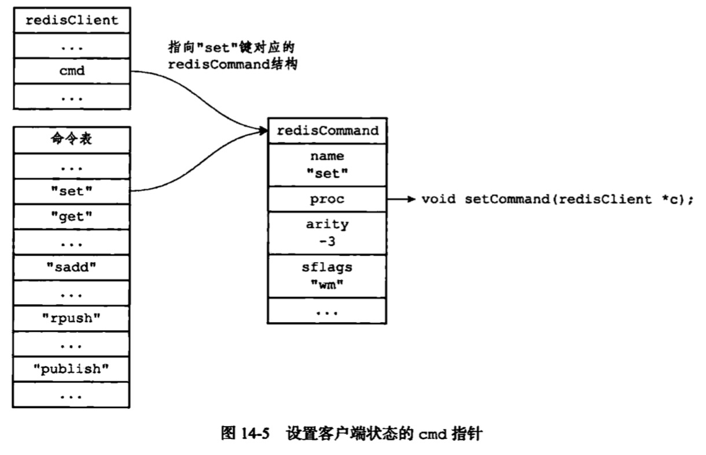

## 服务器
### 本章知识点
1. [命令请求的执行过程](#命令请求的执行过程)  
    1.1 [发送命令请求](#发送命令请求)  
    1.2 [读取命令请求](#读取命令请求)  
    1.3 [命令执行器：查找命令实现](#命令执行器：查找命令实现)  
    1.4 [命令执行器：执行预备操作](#命令执行器：执行预备操作)  
    1.5 [命令执行器：调用命令的实现函数](#调用命令的实现函数)  
    1.6 [命令执行器：执行后续工作](#执行后续工作)  
    1.7 [将命令回复发送给客户端](#将命令回复发送给客户端)  
2. [serverCron函数](#serverCron函数)  
    2.1 [更新服务器时间缓存](#更新服务器时间缓存)  
    2.2 [更新LRU时钟](#更新LRU时钟)  
    2.3 [更新服务器每秒执行命令的次数](#更新服务器每秒执行命令的次数)  
    2.4 [更新服务器内存峰值记录](#更新服务器内存峰值记录)  
    2.5 [处理SIGTERM](#处理SIGTERM)  
    2.6 [管理客户端资源](#管理客户端资源)  
    2.7 [管理数据库资源](#管理数据库资源)  
    2.8 [执行被延迟的BGREWRITEAOF](#执行被延迟的BGREWRITEAOF)  
    2.9 [检查持久化操作的运行状态](#检查持久化操作的运行状态)  
    2.10 [将AOF缓冲区的内容写入到AOF文件](#将AOF缓冲区的内容写入到AOF文件)  
    2.11 [关闭异步客户端](#关闭异步客户端)  
    2.11 [增加时间事件计数器](#增加时间事件计数器)  
3. [初始化服务器](#初始化服务器)  
    3.1 [初始化服务器状态结构](#初始化服务器状态结构) 
    3.2 [载入配置选项](#载入配置选项) 
    3.3 [初始化服务器数据结构](#初始化服务器数据结构) 
    3.4 [还原数据库状态](#还原数据库状态) 
    3.5 [执行时间循环](#执行时间循环) 

Redis服务器负责与多个客户端建立网络连接，处理客户端发送的命令请求，在数据库中保存客户端执行命令所产生的数据。并通过资源管理来维持服务器本身的运转。

### <span id="命令请求的执行过程">命令请求的执行过程</span>
#### 1.1 <span id="发送命令请求">发送命令请求</span>
当用户在客户端输入一个命令请求时，**客户端会将这个命令请求转化为协议格式**，然后通过连接服务器的套接字，将协议格式的命令请求发送给服务器。

#### 1.2. <span id="读取命令请求">读取命令请求</span>
当客户端与服务器之间的链接套接字因为客户端的写入编的可读时，服务器将调用命令请求处理器来执行以下操作：
1. 服务套接字协议格式的命令请求，并将其保存到客户端状态的输入缓冲区里面
2. 对输入缓冲区中的命令请求进行分析，提取出命令请求中包含的命令参数，以及命令参数的个数，分别将参数和参数个数保存到客户端的argc和argc中
3. 调用命令执行器，执行客户端指定的操作。

#### 1.3. <span id="查找命令实现">命令执行器：查找命令实现</span>
命令执行器要做的第一件事就是根据客户端状态argv[0]参数，在命令表查找参数所指定的命令，并将找到的命令保存到客户端状态的cmd属性中。


#### 1.4. <span id="执行预备操作">命令执行器：执行预备操作</span>
+ 检查客户端状态的cmd是否null，如果是的话，说明输入的命令无法找到对应的命令实现，服务器不在执行后续步骤，向客户端返回错误。
+ 检查cmd所指向的redisCommand的arity属性，检查命令请求所给定的参数个数是否正确。当参数个数不正确，返回错误。
+ 检查客户端是否已经通过了身份验证
+ 如果服务器打开了maxmemory功能，那么在执行命令之前，先检查服务器的内存占用情况，并在需要时进行内存回收。如果回收失败，向客户端返回错误。
+ 如果服务器上一次执行BGSAVE命令时出错，并且服务器打开了stop-writes-on-bgsave-error,而且服务器执行的是一个写命令，name服务器拒绝执行这个命令，并向客户端返回一个错误。
+ 如果服务器正在进行数据载入，name客户端发送的命令必须带有1表示（如info、shutdown等）才会被服务器执行，否则被拒绝。
+ 如果执行lua脚本而超时并且进入阻塞状态，那么服务器只会执行客户端发来的shutdown nosave命令和script kill命令，其他被拒绝。
+ 如果客户端正在执行事务，name服务器只接受客户端的exec，discard、mutilate、watch命令，其他的都会放到事务队列中。
+ 如果服务器打开了监视器功能，那么服务器将要执行的命令和参数等信息发送给监视器。

#### 1.5. <span id="调用命令的实现函数">命令执行器：调用命令的实现函数</span>
执行client->cmd->proc(client);产生相应的命令回复，这些回复被保存在客户端的buf属性和reply属性。

#### 1.6. <span id="执行后续工作">命令执行器：执行后续工作</span>
+ 若是开启了慢查询日志功能，检查刚刚执行完的命令请求是否需要添加到慢查询日志中；
+ 根据刚刚执行的命令所耗的时长，更新redisCommand结构的milliseconds属性，并将calls计数器+1；
+ 如果开启AOF持久化，name将刚刚执行的命令写入到aof缓冲区。
+ 如果有其他从服务器正在复制当前这个服务器，那么服务器会将刚刚执行的命令传播给所有的从服务器。

#### 1.7. <span id="将命令回复发送给客户端">将命令回复发送给客户端</span>
当客户端套接字变成可写状态，服务器就会执行命令回复处理器，将保存在客户端输出缓冲区的命令回复发送给客户端。
当命令回复发送完毕，回复处理器会清空客户端状态的输出缓冲区，未下一个请求做准备。

### 2. <span id="serverCron函数">serverCron函数</span>
redis服务器中serverCron函数默认每隔100毫秒执行一次，这个函数负责管理服务器的资源，并保持服务器自身的良好运转。

#### 2.1 <span id="更新服务器时间缓存">更新服务器时间缓存</span>
redis服务器有不少操作需要获取系统当前时间，每次获取系统的时间都需要执行一次系统调用，为了减少系统调用次数将时间缓存了。
```
struct redisServer {
     //...
     
     // 保存秒级精度的系统当前unix时间戳
     time_t unixtime;
     
     // 保存毫秒级精度的系统当前的unix时间戳
     long long mstime;
 } ;
```
serverCron每隔100毫秒更新unixtime和mstime属性，因此这两个属性的精度并不高。
+ 丢与精度要求不太高的用这两个属性：如打印日志、更新服务器的LRU时钟、决定是否执行持久化任务等
+ 对于高精度要求的功能，需要调用系统时间，如设置键过期时间、添加慢查询日志

#### 2.2 <span id="更新LRU时钟">更新LRU时钟</span>
服务器状态中的lrulock属性保存了服务器的lru时钟，也是缓存的。
```
struct redisServer {
     //...
     // 默认每10秒更新一次的时钟缓存，用于计算键的空转时长
     unsigned lrulock:22;
 } ;
```
每个redis对象都有一个lru属性，这个属性保存了对象最后一次被访问的时间。

#### 2.3 <span id="更新服务器每秒执行命令的次数">更新服务器每秒执行命令的次数</span>
serverCron函数中的trackOperationsPerSecond函数会以每100毫秒一次的频率执行，这个函数的功能是**以抽样计算**的方式，估算并记录服务器在最近一秒钟处理的命令请求数量，这个值可以通过info status命令的instantaneous_ops_per_sec查看。
trackOperationsPerSecond函数和服务器状态中四个ops_set_开头的属性有关：
```
struct redisServer {
     //...
     // 上一次进行抽样的时间
     long long ops_sec_last_sample_time;
     // 上一次抽样时，服务器已执行命令的数量
     long long ops_sec_last_sample_ops;
     // 数组中的每个项都记录了一次抽样结果，默认16的环形数组
     long long ops_sec_sample[REDIS_OPS_SEC_SAMPLES];
     // ops_sec_sample的索引，每次抽样将此值递增，在值等于16重置为0，使得构成一个环形数组
     int ops_sec_idx;
 } ;
```

#### 2.4 <span id="更新服务器内存峰值记录">更新服务器内存峰值记录</span>
比较，看是否需要修改
```
struct redisServer {
     //...
     // 已使用的内存峰值
     size_t stat_peek_memory;
 } ;
```

#### 2.5 <span id="处理SIGTERM">处理SIGTERM</span>
在服务器启动时，redis会为服务器进程的sigterm信号关联处理器，这个信号处理器负责在服务器接到SIGTERM信号，打开服务器状态shutdown_asap标志。
每次serverCron函数运行时，程序都会对服务器状态的shutdown_asap属性进行检查，并根据属性值决定是否关闭服务器
```
struct redisServer {
     //...
     // 关闭服务器的标志：1关闭服务器，0不做动作
     int shutdown_asap;
 } ;
```

#### 2.6 <span id="管理客户端资源">管理客户端资源</span>
serverCron函数每次执行都会调用clientsCron函数，这个函数会对一定数量的客户端进行检查：
+ 如果客户端和服务器之间的链接已经超时，那么就释放这个客户端
+ 如果客户端上次执行命令请求之后，输入缓冲区的大小超过了一定的长度，那么程序会释放客户端当前的输入缓冲区，并创建一个默认大小的输入缓冲区，从而防止客户端输入缓冲区耗费了过多的内存。

#### 2.7 <span id="管理数据库资源">管理数据库资源</span>
serverCron函数每次执行都会调用databasesCron函数，这个函数会对服务器中的一部分数据库进行检查，删除其中的过期键，并在有需要时对字典进行收缩操作。

#### 2.8 <span id="执行被延迟的BGREWRITEAOF">执行被延迟的BGREWRITEAOF</span>
在服务器执行BGSAVE期间，如果客户端发来BGREWRITEAOF，将被延迟到BGSAVE命令之后执行。
```
struct redisServer {
     //...
     // 如果值为1，那么表示有BGREWRITEAOF被延迟了。
     int aof_rewrite_scheduled;
 } ;
```

#### 2.9 <span id="检查持久化操作的运行状态">检查持久化操作的运行状态</span>
```
struct redisServer {
     //...
     // 记录执行BGSAVE命令的子进程id，如果没有则为-1
     pid_t rdb_child_pid;
     // 记录执行BGREWRITEAOF命令的子进程id，如果没有则为-1
     pid_t aof_child_pid;
 } ;
```


#### 2.10 <span id="将AOF缓冲区的内容写入到AOF文件">将AOF缓冲区的内容写入到AOF文件</span>
开启了aof持久化且aof缓冲区有带写入的内容

#### 2.11 <span id="关闭异步客户端">关闭异步客户端</span>
关闭输出缓冲区大于限制的客户端

#### 2.12 <span id="增加时间事件计数器">增加时间事件计数器</span>
```
struct redisServer {
     //...
     // serverCron函数运行次数计数器，每执行一次，增加1
     int cronloops;
 } ;
```

### <span id="初始化服务器">初始化服务器</span>
#### 3.1 <span id="初始化服务器状态结构">初始化服务器状态结构</span>
+ 设置服务器的运行id
+ 设置服务器的默认运行频率
+ 设置服务器的默认配置文件路径
+ 设置服务器的运行架构
+ 设置服务器的默认端口号
+设置服务器的默认RDB持久化条件和AOF持久化条件
+ 初始化服务器的LRU时钟
+ 创建命令表

#### 3.2 <span id="载入配置选项">载入配置选项</span>
在启动服务器时，用户可以通过给定配置参数或者指定配置文件来修改服务器默认配置
+ 端口，redis-server --port 10086
+ 配置文件（可以包含默认的数据库数量，关闭rdb压缩功能），redis-server redis.conf
+ ...

#### 3.3 <span id="初始化服务器数据结构">初始化服务器数据结构</span>
之前程序之创建了命令表，现在还需要创建其他数据结构，如clients、db数组、pubsub_channels字典、lua环境、slowlog属性等

除了数据结构，还包含一些重要的设置操作，如：
+ 创建共享对象
+ 打开服务器坚挺的端口
+ 为serverCron创建时间事件
+ 如果AOF持久化打开，那么打开现有的AOF文件，若是AOF不存在，那么创建一个新的AOF文件，为AOF写入做准备

#### 3.4 <span id="还原数据库状态">还原数据库状态</span>
在完成服务器server变量的初始化，服务器需要载入RDB文件或者AOF文件，一次还原数据库状态。
先根据AOF，没有则根据RDB

#### 3.5 <span id="执行时间循环">执行时间循环</span>


