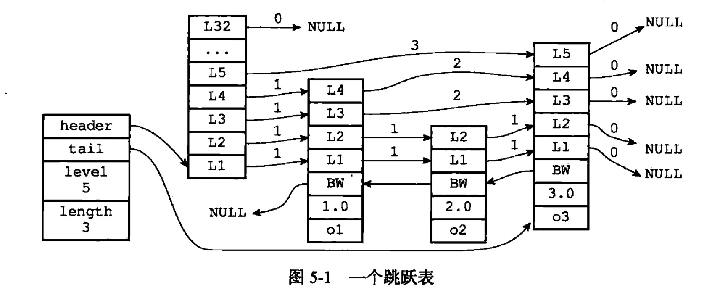

## 跳跃表 - 有序集合
跳跃表是一种有序的数据结构，他通过在每个节点中维持多个指向其他节点的指针，从而达到快速访问节点的目的。  
跳跃表支持平均O(logN)、最坏O(N)复杂度的节点查找，还可以通过顺序性操作来批量处理节点。  
跳跃表的实现比平衡树简单，所以不少程序都用跳跃表来代替平衡树。

### 使用场景：
1. 实现有序集合的键（当包含了数量比较多的元素，又或者列表包含的元素都是比较长的字符串）
2. 集群节点中用作内部数据结构

### 定义：


跳跃表
```
typedef struct zskiplist {
    // 表头和表尾节点
    struct zskiplistNode *header, *tail;
    // 表中节点的数量，不包括表头
    unsigned long length;
    // 表中层数最大的节点的层数，表头节点的层数不计算在内
    int level;
}zskiplist;
```

跳跃表的元素
```
typedef struct zskiplistNode {
    // 层，节点中用L1、L2、L3等标记各个层，L1代表第一层，以此类推。
    struct zskiplistLevel {
        // 前进指针，表尾方向的其他节点
        struct zskiplistNode *forward;
        // 跨度，记录前进指针所指向节点和当前节点的距离（为了计算排名）
        unsigned int span;
    } level[];
    
    // 后退指针，指的是当前节点的前一个元素
    struct zskiplistNode *backward;
    
    // 分值
    double score;
    
    // 成员对象
    obj *obj;
}zskiplistNode;
```